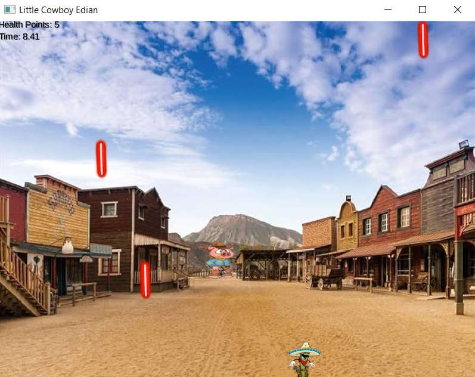

# Welcome to Little Edian Adventure

## Creators:

Ian Chan | **A00910012** | beingaturtle

Edro Gonzales | **A01257468** | Nog-bs

# Game Guide

## Pre-requisites

- Must be using Java 18 to run this game.

## Getting Started

1. Clone the project repository using `git clone`.

2. Run the program from the `DesktopLauncher.java` that is within the desktop.

## Controls

- You can move your characters using the following keys:
  - **Up Arrow** to jump
  - **Left Arrow** to move left
  - **Right Arrow** to move right

## Goal of the Game

Your character will start off with 5 health and your goal is to survive as long as possible dodging projectiles as it progressively gets harder. If you last past a minute, you will receive a very hard ramp-up in difficulty. Hope you will enjoy the game :) !

### Reflection

This game was an awesome way for us to solidify what we learnt about OOP the past few months. Coming from a term where we focussed more on procedural based programming with Python, the shift to OOP was a very welcoming challenge and this game demonstrates concepts that we learned over the term. Enjoy!